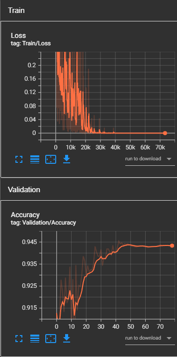
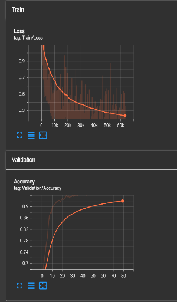
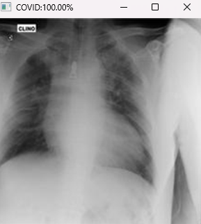
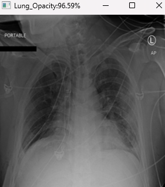
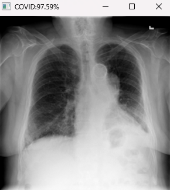
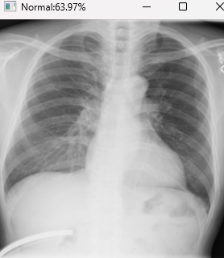
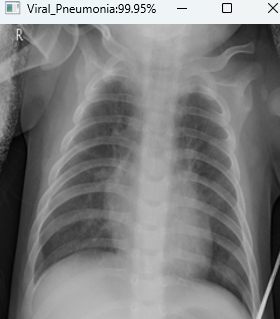

# COVID CLASSIFICATION WITH COVID-19_Radiography_Dataset 

---
- Using Vision Transformer model to classify Chest X-ray Images with COVID-19_Radiography_Dataset
- Link dataset: https://www.kaggle.com/datasets/tawsifurrahman/covid19-radiography-database

## Classification:

---
- Using ViT-B16 model to classify chest x-ray
- Link repository: 
  - https://github.com/google-research/vision_transformer
### Vision Transformer Model:


---
### Accuracy:
### 1. ViT_B16:
- Train 100 epochs:
#### 


### 2. ResNet50
- Train 80 epochs:
#### 

### 3. EfficientNet_B0:
- Train 80 epochs:
#### 

### 4. DenseNet_121:
- Train 80 epochs:
####   


---
### Report:
#### 1. ViT_B16:
```txt
                 precision    recall  f1-score   support

          COVID       0.98      0.98      0.98       723
   Lung_Opacity       0.95      0.91      0.92      1202
         Normal       0.94      0.97      0.95      2037
Viral_Pneumonia       0.98      0.96      0.97       269

       accuracy                           0.95      4231
      macro avg       0.96      0.95      0.96      4231
   weighted avg       0.95      0.95      0.95      4231
```

#### 2. ResNet50:
```txt
                 precision    recall  f1-score   support

          COVID       0.99      0.97      0.98       723
   Lung_Opacity       0.95      0.93      0.94      1203
         Normal       0.95      0.97      0.96      2039
Viral_Pneumonia       0.97      0.94      0.96       269

       accuracy                           0.95      4234
      macro avg       0.96      0.95      0.96      4234
   weighted avg       0.95      0.95      0.95      4234

```

#### 3. EfficientNet_B0:
```txt
                 precision    recall  f1-score   support

          COVID       0.99      0.96      0.97       723
   Lung_Opacity       0.95      0.92      0.94      1203
         Normal       0.94      0.97      0.96      2039
Viral_Pneumonia       0.98      0.97      0.97       269

       accuracy                           0.96      4234
      macro avg       0.97      0.96      0.96      4234
   weighted avg       0.96      0.96      0.96      4234

```

#### 4. DensetNet_121:
```txt
                 precision    recall  f1-score   support

          COVID       0.99      0.95      0.97       723
   Lung_Opacity       0.94      0.93      0.94      1203
         Normal       0.95      0.97      0.96      2039
Viral_Pneumonia       0.98      0.96      0.97       269

       accuracy                           0.95      4234
      macro avg       0.96      0.95      0.96      4234
   weighted avg       0.95      0.95      0.95      4234

```


---
### Confusion matrix of ViT_B16:


---
### Evaluation
- The models perform very well, average accuracy: `0.95` - `0.96`.
- COVID: Precision is very high: `0.98` `0.99`.
- Lung Opacity: Precision: `0.95`, Recall: `0.91`. The model may predict wrong some cases.
- Normal: High Recall `0.97`.
- Viral_Pneumonia: Extremely high Precision and Recall `0.99`, models very good.

#### Conclusion, the models very good with high accuracy, precision, recall and F1-Score.

---
### Test
1. COVID: 
#### 
2. Lung Opacity:
#### 
3. Normal:
#### 
4. Viral_Pneumonia:
#### 

---

## HOW TO USE:
### 1. Prepare Environment
- clone this repo
- activate your conda env or create new anaconda env
- then install:
```text
pip install -r requirements.txt
```

### 2. Prepare your dataset
- If your dataset doesn't have train, test, valid, you can use create_dataset.py to format dataset as below:
```text
data
├── breast_tumors
│   ├── train_images           
│   ├── train_masks             
│   ├── val_images        
│   ├── val_masks         
│   ├── test_images       
│   └── test_masks        
│
├── brain_tumors
│   ├── train_images            
│   ├── train_masks            
│   ├── val_images        
│   ├── val_masks         
│   ├── test_images       
│   └── test_masks        
│
└── ...        
```
#### source format: https://github.com/HealthX-Lab/MedCLIP-SAMv2
- If you doesn't use masks for segmentation project, you can change in create_dataset.py
```text
    if not os.path.exists(all_images_path):
        os.makedirs(all_images_path)
        os.makedirs(os.path.join(all_images_path, "train_images"))
        os.makedirs(os.path.join(all_images_path, "train_masks"))
        os.makedirs(os.path.join(all_images_path, "val_images"))
        os.makedirs(os.path.join(all_images_path, "val_masks"))
        os.makedirs(os.path.join(all_images_path, "test_images"))
        os.makedirs(os.path.join(all_images_path, "test_masks"))

    os.makedirs(os.path.join(output_category_path, "train_images"))
    os.makedirs(os.path.join(output_category_path, "train_masks"))
    os.makedirs(os.path.join(output_category_path, "val_images"))
    os.makedirs(os.path.join(output_category_path, "val_masks"))
    os.makedirs(os.path.join(output_category_path, "test_images"))
    os.makedirs(os.path.join(output_category_path, "test_masks"))
    
    # REMOVE all masks if you does not use
```
```text
    for image_file, mask_file in tqdm(zip(image_train, mask_train), total=len(image_train), desc=f"Copying train {category}", colour='green'):
        img_src = os.path.join(images_path, image_file)
        mask_src = os.path.join(masks_path, mask_file)
        img_dst = os.path.join(output_category_path, "train_images", image_file)
        mask_dst = os.path.join(output_category_path, "train_masks", mask_file)

        all_img_dst = os.path.join(all_images_path, "train_images", image_file)
        all_mask_dst = os.path.join(all_images_path, "train_masks", mask_file)

        img = cv2.imread(img_src)
        mask = cv2.imread(mask_src)
        img = cv2.resize(img, (512, 512))
        mask = cv2.resize(mask, (512, 512))

        cv2.imwrite(img_dst, img)
        cv2.imwrite(mask_dst, mask)
        cv2.imwrite(all_img_dst, img)
        cv2.imwrite(all_mask_dst, mask)
    
    # REMOVE all masks if you does not use
```
```text
if __name__ == '__main__':
    if not os.path.exists("data"):
        os.mkdir("data")
    all_image_output = "lung_xray"
    data_path = "./dataset/COVID-19_Radiography_Dataset"
    output_path = "./data"
    categories = ["COVID", "Lung_Opacity", "Normal", "Viral_Pneumonia"]
    for category in categories:
        create_dataset(data_path, output_path, category, all_image_output)

# Change with your custom dataset.
```

## 2. Training:
- If you want to fine-tune ViT-b16 model. you can config the dataset.py
```text
class COVID19_Classification_Dataset(Dataset):
    def __init__(self, root, train=True, transform=None):
        self.root = root
        self.train = train
        self.transform = transform
        self.categories = ["COVID", "Lung_Opacity", "Normal", "Viral_Pneumonia"]
        if train:
            mode = "train_images"
        else:
            mode = "valid_images"

        data = [os.path.join(self.root, cate, mode) for cate in self.categories]
        self.images = []
        self.labels = []
        for i, images_path in enumerate(data):
            label = i
            for image in os.listdir(images_path):
                self.images.append(os.path.join(images_path, image))
                self.labels.append(label)

    def __len__(self):
        return len(self.labels)

    def __getitem__(self, idx):
        image_file = self.images[idx]
        label = self.labels[idx]
        image = cv2.imread(image_file)
        if self.transform:
            image = cv2.cvtColor(image, cv2.COLOR_BGR2RGB)
            image = Image.fromarray(image)
            image = self.transform(image)

        return image, label

# Change the categories with your custom dataset.
```
- Training process will be on train.py, you can use any model you like, with this train.py is ViT-b16
- The args:
```text
def get_args():
    parser = ArgumentParser(description="COVID CLASSIFICATION")

    parser.add_argument("--root", '-r', type=str, default="../data", help="root path")
    parser.add_argument("--batch_size", "-b",type=int, default=32, help="batch size")
    parser.add_argument("--epochs", "-e",type=int, default=100, help="number of epochs")
    parser.add_argument("--learning_rate", "-lr",type=float, default=1e-4, help="learning rate")
    parser.add_argument("--weight_decay", "-wd",type=float, default=0.01, help="weight decay")
    parser.add_argument("--momentum", "-m",type=float, default=0.9, help="momentum")
    parser.add_argument("--num_workers", "-nw", type=int, default=4, help="number of workers")
    parser.add_argument("--image_size", '-i', type=int, default=224, help="image size")
    parser.add_argument("--early_stopping", "-p", type=int, default=10, help="early stopping patience")
    parser.add_argument("--logging", '-l', type=str, default="tensorboard", help="logging path")
    parser.add_argument("--checkpoint", '-c', type=str, default=None, help="checkpoint path")
    parser.add_argument("--save_models", "-sv", type=str, default="ViT_b16_models", help="save path")
    parser.add_argument("--report", '-rp', type=str, default="classification_reports", help="classification_report path")

    args = parser.parse_args()
    return args
```
- If you want to train:
```text
Python train.py --root PATH/TO/YOUR/DATASET --early_stopping number_epochs --save_models PATH/TO/YOUR/SAVE/MODEL
```
- The early-stopping will stop training if over number_epochs that model doesn't increase accuracy
- You can change your save_models with `--save_model path/to/your/save/folder`
- Whenever you train, their will be `best_model.pt` and `last_model.pt` in save_models folder, you can continue your training step with last_model.pt and use best_model.pt to test with your test_folder
- How to continue Training: `--checkpoint PATH/TO/last_model.pt`

## MY CHECKPOINT:


---

# REFERENCES
- Thank you google-research
- Link google-research projects: https://github.com/google-research
